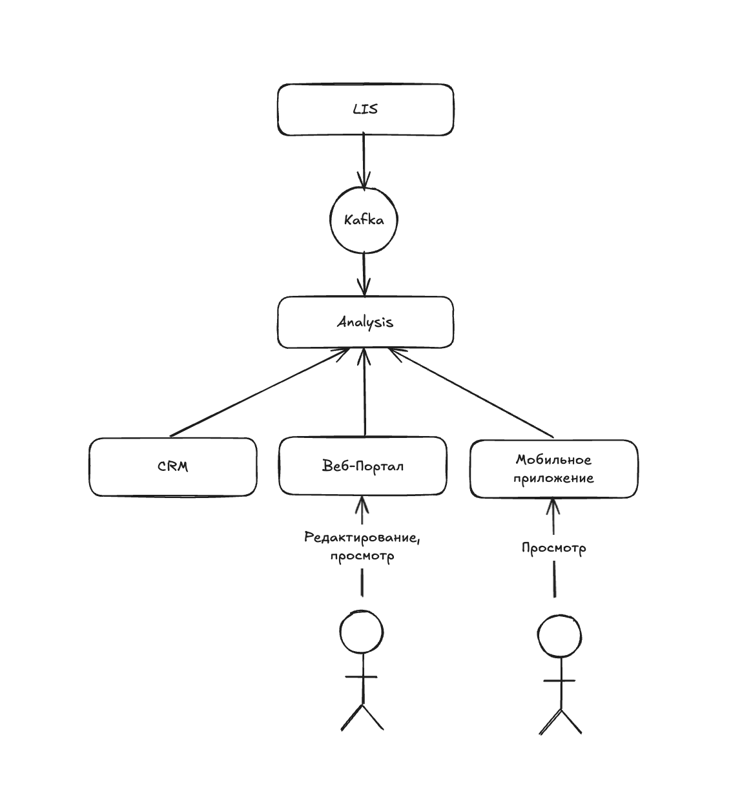

# Надёжная поставка результатов анализов в мобильное приложение

## В текущем решении есть следующие проблемы:
* Нет надёжной доставки результатов анализов. В процессе загрузки некоторые файлы могут теряться.
* Загрука результатов иногда осуществляется с задержками.
* У лаборантов нет возможности редактировать анализы.
* Пользователи не могут просматривать результаты самостоятельно.
* Анализы грузятся в CRM, что негативно может влиять на производительность и доступность сервиса.

## В целевом решении:
* Необходимо создать отдельный микросервис для хранения, редактирования и просмотра анализов с ролевой моделью.
* Асинхронно загружать анализы из LIS в этот сервис. Добавить ключ идемпотентности для дедупликации, а также transactional outbox, чтобы обеспечить exactly once. Ключом может выступать уникальный id анализа в сервисе LIS.
* Подробнее про механизм transactional outbox: новый анализ, поступивший в LIS, в одной транзакции также записывается в таблицу outbox. Отдельный фоновый процесс достает новые записи из таблицы outbox, продьюсит их в Кафку и в конце помечает запись отправленной.
* Уведомлять пользователей о поступлении новых анализов.

## Альтернативы

| Описание | Плюсы | Минусы |
| --- | --- | --- |
| Синхронная выгрузка из LIS в сервис анализов c дедупликацией по ключу идемпотентности и ретраями | * Минимальная задержка - анализы сразу попадают в систему   * Лаборанты могут редактировать анализы   * Снимается нагрузка с CRM | * Нужно делать самописную механику надёжной доставки анализов |
| Асинхронная выгрузка через Кафка с дедупликацией по ключу идемпотентности и transactional outbox | * Небольшая задержка в периоды стабильной работы сервисов   * Лаборанты могут редактировать анализы   * Снимается нагрузка с CRM   * Данные можно перечитать из кафки   * Кафка сглаживает пиковые нагрузки | * В случае пиковых нагрузок анализы могут появляться с задержками   * Нужен transactional outbox в LIS для того, чтобы не потерять анализы |
| Пакетная выгрузка анализов LIS в сервис анализов | * Лаборанты могут редактировать анализы   * Снимается нагрузка с CRM   * Надёжная доставка данных   * Относительная простота реализации | * Результаты будут появляться не мгновенно |